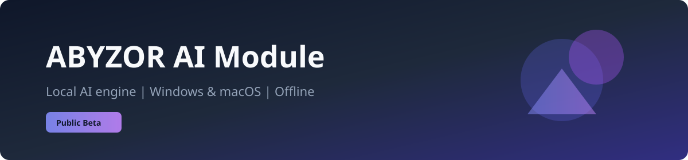
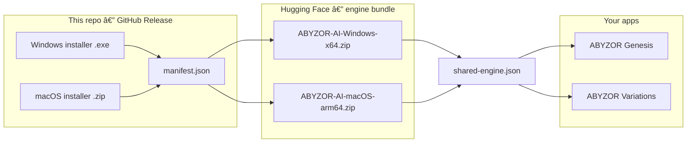

<p align="center">
  
</p>

<p align="center">
  <a href="https://github.com/abyzor/abyzor-ai-module/releases"></a>
  <a href="https://github.com/abyzor/abyzor-ai-module/releases"></a>
  <a href="https://github.com/abyzor/abyzor-ai-module/releases"></a>
  <a href="https://huggingface.co/abyzor/abyzor-ai-module-engine"></a>
</p>

---

## What is this?

This repository is the **public download hub** for the **ABYZOR AI Module** — a separate product from [ABYZOR Genesis](https://github.com/abyzor/abyzor-genesis) and [ABYZOR Variations](https://github.com/abyzor/abyzor-variations).

| | |
|---|---|
| **Purpose** | Install and update the **local AI engine** used by supported ABYZOR apps |
| **Runs** | On your machine — **offline**, no API key, unlimited generations |
| **Hardware** | **CPU** always; **GPU** when available (CUDA on Windows, Apple Silicon on Mac) |
| **Source code** | Private development: [abyzor/abyzor-midi-ai](https://github.com/abyzor/abyzor-midi-ai) (not required to install) |

> **Beta:** releases are marked **Pre-release**. Behavior and compatibility may change between versions.

---

## How it fits together



1. You download the **installer** from [Releases](https://github.com/abyzor/abyzor-ai-module/releases).
2. The installer reads **`manifest.json`** (same release) for version, checksums, and engine URLs.
3. The **engine** (~400 MB–3 GB) is fetched from [Hugging Face](https://huggingface.co/abyzor/abyzor-ai-module-engine), verified with **SHA-256**, then installed locally.
4. Host apps find the engine via **`shared-engine.json`**.

Engine archives are **not** attached to GitHub releases (size limits); only the manifest points to Hugging Face **`/resolve/`** URLs.

---

## Install

Open **[Releases](https://github.com/abyzor/abyzor-ai-module/releases)** (include pre-releases) and pick the latest **`vX.Y.Z`**.

### Windows 11 / 10 (x64)

| Step | Action |
|:--:|--------|
| 1 | Download **`ABYZOR_AI_Module_Installer_vX.Y.Z.exe`** |
| 2 | Run the installer → **Install** (or **Update** / **Reinstall** if already installed) |
| 3 | Finish when you see **AI MODULE READY** |

**Registration file:** `%LOCALAPPDATA%\ABYZOR\shared-engine.json`  
**Install logs:** `%LOCALAPPDATA%\ABYZOR\Installer\logs\`

### macOS (Apple Silicon — `arm64`)

| Step | Action |
|:--:|--------|
| 1 | Download **`ABYZOR_AI_Module_Installer_vX.Y.Z-macos-arm64.zip`** |
| 2 | Unzip → open **`AbYZOR.Installer.app`** |
| 3 | Complete install → **AI MODULE READY** |

**Registration file:** `~/Library/Application Support/ABYZOR/shared-engine.json`

On first launch, macOS may block unsigned beta builds. Use **System Settings → Privacy & Security → Open Anyway** if prompted (notarization is planned for a later stable channel).

---

## Updates

The same installer handles:

| Mode | When |
|------|------|
| **Update** | Newer version in `manifest.json` / release |
| **Reinstall** | Repair engine or registration |
| **Uninstall** | Remove module and optional engine files |

Latest manifest URL (example for pinned version):

`https://github.com/abyzor/abyzor-ai-module/releases/download/vX.Y.Z/manifest.json`

---

## Release contents (each tag `vX.Y.Z`)

| Asset | Platform | Role |
|-------|----------|------|
| `ABYZOR_AI_Module_Installer_vX.Y.Z.exe` | Windows | End-user installer |
| `ABYZOR_AI_Module_Installer_vX.Y.Z-macos-arm64.zip` | macOS | `.app` inside the zip |
| `manifest.json` | Both | Single file: `platforms.windows-x64` + `platforms.macos-arm64` |

| Hugging Face file | Platform |
|-------------------|----------|
| [`ABYZOR-AI-Windows-x64.zip`](https://huggingface.co/abyzor/abyzor-ai-module-engine/tree/main) | Windows engine + model |
| [`ABYZOR-AI-macOS-arm64.zip`](https://huggingface.co/abyzor/abyzor-ai-module-engine/tree/main) | macOS engine + model |

---

## Products (do not confuse)

| Product | Role | Needs AI Module? |
|---------|------|------------------|
| **[ABYZOR Genesis](https://github.com/abyzor/abyzor-genesis)** | Free MIDI generator (VST / standalone) | Optional — procedural MIDI works without it |
| **ABYZOR AI Module** (this repo) | Local AI engine | — |
| **[ABYZOR Variations](https://github.com/abyzor/abyzor-variations)** | Paid MIDI workflow | Can use the module when installed |

---

## For maintainers

Build and publish from the private monorepo `abyzor-midi-ai` (see `docs/installer-release-checklist.md` there).

**Windows installer + manifest base:**

```powershell
.\packaging\installer\publish_ai_module_release.ps1 -Version X.Y.Z -SkipEngineBuild
```

**macOS installer:** GitHub Actions → **AI Module Installer (macOS)**, or `publish_ai_module_macos.sh` on a Mac.

**macOS engine on Hugging Face:** Actions → **AI Module Engine (macOS)** with `upload_huggingface=true`.

Attach **`dist/`** installers + unified **`manifest.json`** to a **Pre-release** on this repo. Engine zips live on Hugging Face only.

---

## Links

- [Download releases](https://github.com/abyzor/abyzor-ai-module/releases)
- [Engine model repo (Hugging Face)](https://huggingface.co/abyzor/abyzor-ai-module-engine)
- [ABYZOR Genesis](https://github.com/abyzor/abyzor-genesis)
- [ABYZOR Variations](https://github.com/abyzor/abyzor-variations)
